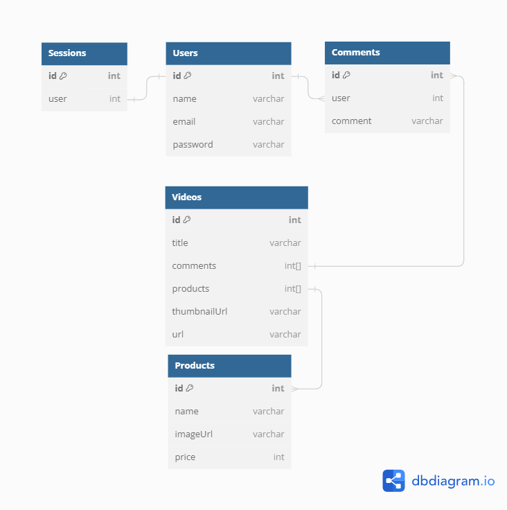

# Tokopedia Play
#### Author: [Whauzan](https://www.showwcase.com/whauzan)

This is repository for Generasi Gigih 3.0 - [GoTo Impact Foundation]([goto-impact.org](https://www.goto-impact.org/))

## Features

- User Authentication (Login and Register) with Refresh Access Token
- Create and Read Video (List Video and One Video by VideoId)
- Create Comment and push it to video
- Create Product
- Add Product to Video
- Get Comment List by Video Id
- Get Product List by Video Id

## Tech

This repository are using:

- [Node.js](https://nodejs.org/en)
- [Express.js](https://expressjs.com/)
- [TypeScript](https://www.typescriptlang.org/)
- [MongoDB](https://www.mongodb.com/)
- [Mongoose](https://mongoosejs.com/)
- [Typegoose](https://typegoose.github.io/typegoose/)
- [Nodemon](https://nodemon.io/)
- [Zod](https://zod.dev/)

## Installation

It requires [Node.js](https://nodejs.org/en) to run.

Install the dependencies.

```sh
npm install
```

## Running
Before running the application, make sure you already copy .env.example .env file and fill the environment variables.
```sh
npm run dev
```

## Database Structure
Since I'm using MongoDB, I tried to rationalize the database structure like this:
<!--  -->
<div align="center">
    <picture>
        <source srcset="/backend/database_structure.png">
        
    </picture>
</div>

Based on database structure above, There will be 5 Collection, User, Session, Video, Comment, and Product. All of these are using Reference instead of Embedded Document because In My Opinion, in terms of scalability, Reference are better.

# API Structure
## Users
- User Object
```
{
    _id: string,
    name: string,
    email: string,
    password: string,
    created_at: datetime(iso 8601),
    updated_at: datetime(iso 8601)
}
```
## GET /users/me
Returns logged in user
* **URL Params**  
  None
* **Data Params**  
  None
* **Headers**  
  Content-Type: application/json  
  Authorization: Bearer `<Access Token>`
* **Success Response:** 
* **Code:** 200  
  **Content:** 
  ```
  {
    "message": "Succesfully Get Current User",
    "error": false,
    "code": 200,
    "data": {
        _id: string,
        name: string,
        email: string,
        created_at: datetime(iso 8601),
        updated_at: datetime(iso 8601),
        iat: NumericDate,
        exp: NumericDate
    }
  }
  ```
* **Error Response:**  
  * **Code:** 403  
  **Content:**   
    ```
    {
        "message": "You must be logged in",
        "code": 403,
        "error": true
    }
    ```
## POST /users
Creates a new User and returns the new object
* **URL Params**  
  None
* **Data Params**  
  ```
  {
    "name": string,
    "email": string,
    "password": string,
    "passwordConfirmation": string,
  }
  ```
* **Headers**  
  Content-Type: application/json
* **Success Response:** 
* **Code:** 200  
  **Content:** 
  ```
  {
    "message": "Successfully Created User",
    "error": false,
    "code": 200,
    "data": {
        "_id": string,
        "name": string,
        "email": string,
        "created_at": datetime(iso 8601),
        "updated_at": datetime(iso 8601),
    }
  }
  ```
* **Error Response:**  
  * **Code:** 409  
  **Content:**   
    ```
    {
        "message": "Account already exists",
        "code": 409,
        "error": true
    }
    ```
  OR  
  * **Code:** 400  
  **Content:**
    ```
    {
        "message": "Name is required",
        "code": 400,
        "error": true
    }
    ```
  OR  
  * **Code:** 400  
  **Content:**
    ```
    {
        "message": "Email is required",
        "code": 400,
        "error": true
    }
    ```
  OR  
  * **Code:** 400  
  **Content:**
    ```
    {
        "message": "Password is required",
        "code": 400,
        "error": true
    }
    ```
  OR  
  * **Code:** 400  
  **Content:**
    ```
    {
        "message": "Password confirmation is required",
        "code": 400,
        "error": true
    }
    ```
  OR  
  * **Code:** 400  
  **Content:**
    ```
    {
        "message": "Password do not match",
        "code": 400,
        "error": true
    }
    ```
## Sessions
- Session Object
```
{
    _id: string,
    user: string,
}
```
## POST /session
Create a new session for Login User and return access token and refresh token
* **URL Params**  
  None
* **Data Params**  
  ```
  {
    "email": string,
    "password": string,
  }
  ```
* **Headers**  
  Content-Type: application/json
* **Success Response:** 
* **Code:** 200  
  **Content:** 
  ```
  {
    "message": "Successfully signed",
    "error": false,
    "code": 200,
    "data": {
        "accessToken": string,
        "refreshToken": string
    }
  }
  ```
* **Error Response:**
  * **Code:** 401   
  **Content:**   
    ```
    {
        "message": "Invalid credentials",
        "code": 401,
        "error": true
    }
    ```
  Or
  * **Code:** 400  
  **Content:**
    ```
    {
        "message": "Email is required",
        "code": 400,
        "error": true
    }
    ```
  Or
  * **Code:** 400  
  **Content:**
    ```
    {
        "message": "Password is required",
        "code": 400,
        "error": true
    }
    ```
## POST /session/refresh
Refresh the session with the refresh token and return the access token
* **URL Params**  
  None
* **Data Params**  
  None
* **Headers**  
  Content-Type: application/json  
  x-refresh: `<Refresh Token>`
* **Success Response:** 
* **Code:** 200  
  **Content:** 
  ```
    {
        "message": "Successfully refreshed access token",
        "error": false,
        "code": 200,
        "data": {
            "accessToken": string
        }
    }
  ```
* **Error Response:**
  * **Code:** 401   
  **Content:**   
    ```
    {
        "message": "Could not refresh access token",
        "code": 401,
        "error": true
    }
    ```

## Products
- Product Object
```
{
    _id: string,
    name: string,
    email: string,
    imageUrl: string,
    price: integer
    created_at: datetime(iso 8601),
    updated_at: datetime(iso 8601)
}
```
## POST /products
Create a new product and return the new product object
* **URL Params**  
  None
* **Data Params**  
  ```
    {
        "name": string,
        "imageUrl": string,
        "price": integer,
    }
  ```
* **Headers**  
  Content-Type: application/json
* **Success Response:** 
* **Code:** 200  
  **Content:** 
  ```
  {
    "message": "Successfully created product",
    "error": false,
    "code": 200,
    "data": {
        "_id": string,
        "name": string,
        "imageUrl": string,
        "price": integer,
        "created_at": datetime(iso 8601),
        "updated_at": datetime(iso 8601),
    }
  }
  ```
* **Error Response:**
  * **Code:** 400   
  **Content:**   
    ```
    {
        "message": "Name is required",
        "code": 400,
        "error": true
    }
    ```
  Or
  * **Code:** 400  
  **Content:**
    ```
    {
        "message": "Image URL is required",
        "code": 400,
        "error": true
    }
    ```
  Or
  * **Code:** 400  
  **Content:**
    ```
    {
        "message": "Price is required",
        "code": 400,
        "error": true
    }
    ```

## Video
- Video Object
```
{
    _id: string,
    title: string,
    thumbnailUrl: string,
    url: string,
    comments: string[],
    products: string[],
    created_at: datetime(iso 8601),
    updated_at: datetime(iso 8601)
}
```
## POST /videos
Create a new video and return the new video object
* **URL Params**  
  None
* **Data Params**  
  ```
  {
    "title": string,
    "thumbnailUrl": string,
    "url": integer,
    "products": string[] // Optional
  }
  ```
* **Headers**  
  Content-Type: application/json
* **Success Response:** 
* **Code:** 200  
  **Content:** 
  ```
  {
    "message": "Successfully created video",
    "error": false,
    "code": 200,
    "data": {
        "_id": string,
        "title": string,
        "thumbnailUrl": string,
        "url": string,
        "products": <product_object>[],
        "comments": <comment_object>[],
        "created_at": datetime(iso 8601),
        "updated_at": datetime(iso 8601),
    }
  }
  ```
* **Error Response:**
  * **Code:** 400   
  **Content:**   
    ```
    {
        "message": "Title is required",
        "code": 400,
        "error": true
    }
    ```
  Or
  * **Code:** 400  
  **Content:**
    ```
    {
        "message": "Thumbnail URL is required",
        "code": 400,
        "error": true
    }
    ```
  Or
  * **Code:** 400  
  **Content:**
    ```
    {
        "message": "URL is required",
        "code": 400,
        "error": true
    }
    ```
## GET /videos
returns a list of videos
* **URL Params**  
  None
* **Data Params**  
  None
* **Headers**  
  Content-Type: application/json
* **Success Response:** 
* **Code:** 200
* **Content:** 
  ```
  {
    "message": "Successfully retrieved videos",
    "error": false,
    "code": 200,
    "data": [
        {
            "_id": string,
            "title": string,
            "thumbnailUrl": string,
            "url": string,
            "created_at": datetime(iso 8601),
            "updated_at": datetime(iso 8601),
        }
    ]
  }
  ```
## GET /videos/:videoId
returns video object by video id
* **URL Params**  
  *Required:* `videoId=[string]`
* **Data Params**  
  None
* **Headers**  
  Content-Type: application/json
* **Success Response:** 
* **Code:** 200
* **Content:** 
  ```
  {
    "message": "Successfully retrieved video",
    "error": false,
    "code": 200,
    "data": {
        "_id": string,
        "title": string,
        "thumbnailUrl": string,
        "url": string,
        "created_at": datetime(iso 8601),
        "updated_at": datetime(iso 8601),
    }
  }
  ```
* **Error Response:**  
  **Code:** 404  
  **Content:**  
  ```
  {
    "message": "Video not found",
    "code": 404,
    "error: true
  }
  ```
## POST /videos/:videoId/products
add products to video and return the updated video object
* **URL Params**  
  None
* **Data Params**  
  ```
  {
    "products": string[]
  }
  ```
* **Headers**  
  Content-Type: application/json
* **Success Response:** 
* **Code:** 200  
  **Content:** 
  ```
  {
    "message": "Successfully added product to video",
    "error": false,
    "code": 200,
    "data": {
        "_id": string,
        "title": string,
        "thumbnailUrl": string,
        "url": string,
        "products": <product_object>[],
        "comments": <comment_object>[],
        "created_at": datetime(iso 8601),
        "updated_at": datetime(iso 8601),
    }
  }
  ```
* **Error Response:**  
  **Code:** 404  
  **Content:**  
  ```
  {
    "message": "Video not found",
    "code": 404,
    "error": true
  }
  ```
## GET /videos/:videoId/products
returns a list of products by video id
* **URL Params**  
  *Required:* `videoId=[string]`
* **Data Params**  
  None
* **Headers**  
  Content-Type: application/json
* **Success Response:** 
* **Code:** 200
* **Content:** 
  ```
  {
    "message": "Successfully retrieved products",
    "error": false,
    "code": 200,
    "data": [
        {<product_object>},
        {<product_object>},
    ]
  }
  ```
* **Error Response:**  
  **Code:** 404  
  **Content:**  
  ```
  {
    "message": "Video not found",
    "code": 404,
    "error": true
  }
  ```
## GET /videos/:videoId/comments
returns a list of comments by video id
* **URL Params**  
  *Required:* `videoId=[string]`
* **Data Params**  
  None
* **Headers**  
  Content-Type: application/json
* **Success Response:** 
* **Code:** 200
* **Content:** 
  ```
  {
    "message": "Successfully retrieved comments",
    "error": false,
    "code": 200,
    "data": [
        {<comment_object>},
        {<comment_object>},
    ]
  }
  ```
* **Error Response:**  
  **Code:** 404  
  **Content:**  
  ```
  {
    "message": "Video not found",
    "code": 404,
    "error": true
  }
  ```